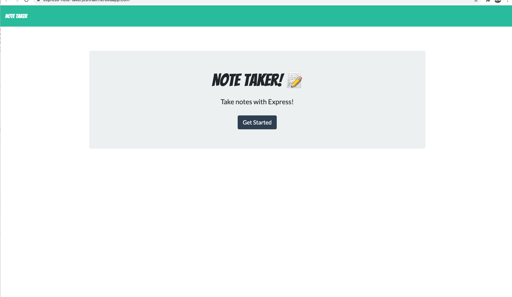

# Express-Note-Taker

an application that can be used to write, save, and delete notes. This application will use an express backend and save and retrieve note data from a JSON file.

## User Story 

AS A user, I want to be able to write and save notes 

I WANT to be able to delete notes I've written before 

SO THAT I can organize my thoughts and keep track of tasks I need to complete 

## Business Context 

For users that need to keep track of a lot of information, it's easy to forget or be  unable to recall something important. Being able to take persistent notes  allows users to have written information available when needed. 

## Acceptance Criteria 

Application should allow users to create and save notes. 

Application should allow users to view previously saved notes. 

Application should allow users to delete previously saved notes. 

